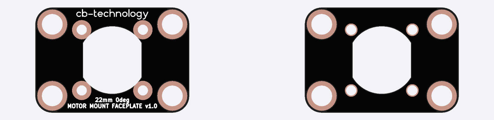
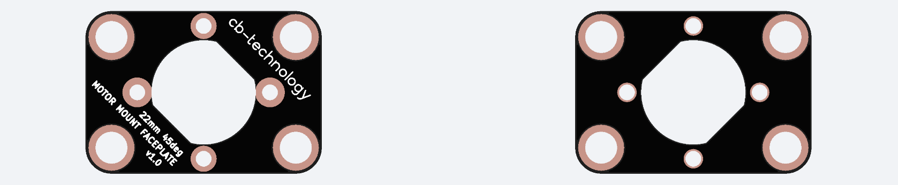

# 22mm MOTOR FACEPLATE MOUNT v1.0 (2-pack)

 

Each faceplate is designed to easily and rigidly panel mount a single 22mm motor to your desired chassis. Coming in 2 options, the 0 and 45degree mount angles, to suit whatever orientation of motor you have chosen.

This product was orignially designed for beetle weight combat robotics but is suitable as a sustitute mount for any application using these 22mm motors. 

This is a [New Zealand](https://www.google.co.nz/maps/place/Christchurch+New+Zealand) based product by [cb-technology](https://www.cb-technology.co.nz/), Connor Benton.

## FEATURES
- Easy and rigid way to panel mount standard 22mm motors.
- Faceplace is constructed from fiberglass so is very rigid while minimising weight. 

## SPECIFICATIONS
- **Dimensions:** 32x22x1.6 mm
- **Weight:** ~2g each
- **Material:** FR4 (Fiberglass)
- **Included in Package:** 2x Faceplates, 4x M4x4 Cap Head Screws
