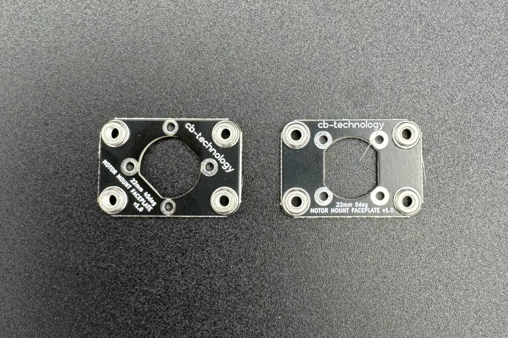
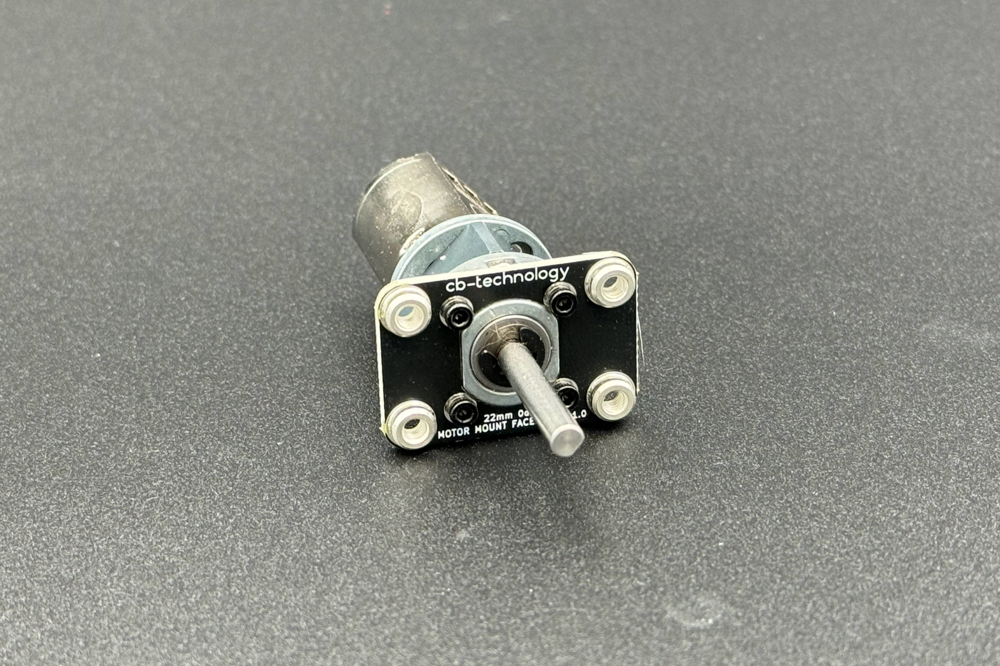
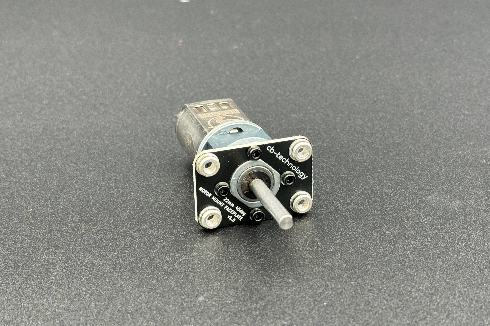

# 22mm MOTOR FACEPLATE MOUNT v1.0 (2-pack)

 

Each faceplate is designed to easily and rigidly panel mount a single 22 motor to your desired chassis using the 4x M3 PEMs on each corner. 
This product was orignially designed for beetle weight combat robotics but is suitable as a sustitute mount for any application using these motors. 

This is a [New Zealand](https://www.google.co.nz/maps/place/Christchurch+New+Zealand) product developed by [cb-technology](https://www.cb-technology.co.nz/), Connor Benton.

#### Variant: 0degree

 

#### Variant: 45degree

 

## FEATURES
- Easy and rigid way to panel mount standard 22 motors.
- Faceplace is constructed from fiberglass so is very rigid while minimising weight. 
- Choose either the 0degree OR 45degree variants to match your specific 22mm motors
- Includes 4x M3 PEM soldered to each corner, elmininating the need for individual nuts and simplifying the installation process

## SPECIFICATIONS
- **Dimensions (Product):** 32 x 22 x 3.6mm
- **Dimensions (Hole Centers):** 25 x 15mm
- **Weight:** 3g each
- **Material:** FR4 (Fiberglass)
- **Included in Package:** 2x Faceplates, 4x M2x4 cap head screws